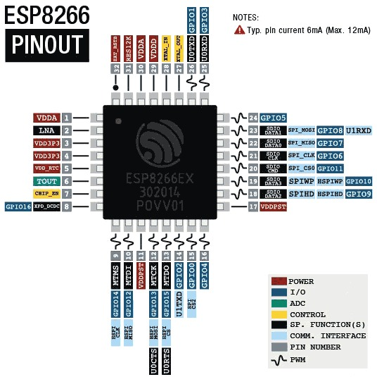
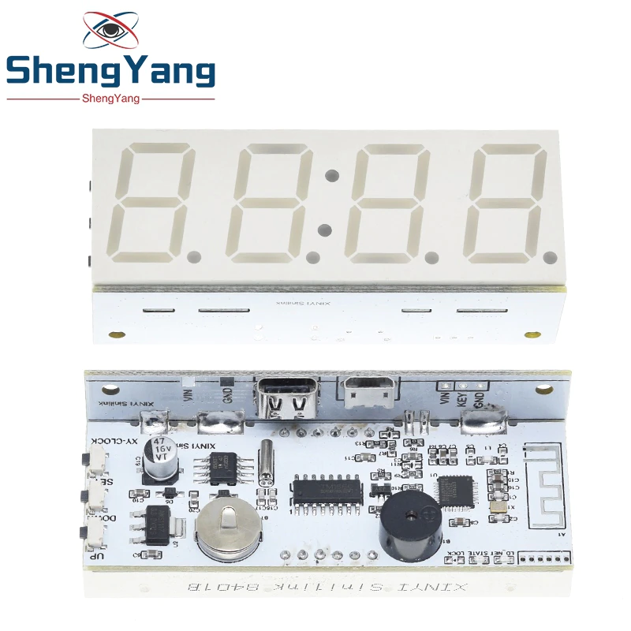

# xy-clock an NTP clock for cheap

This repo rewrites the firmware from a cheap Wifi-clock module to make it an NTP clock.


https://steve.fi/hardware/backup-and-restore/

Programming should be identical to ESP8266-01 board: https://www.monocilindro.com/2017/02/25/flashing-esp8266-using-ftdi-and-arduino-ide/

```
debug port to 8285
https://wiki.tinkernet.ca/images/7/75/ESP8266-Pinout.jpeg
1 gnd
2 u0txd gpio1 (26)  "TX"
3 u0rxd gpio3 (25)  "RX"
4 spi cs2 gpio0 (15)  "FLASH" When pulled LOW: bootloader mode
5 chip_en (7)  "CH_PD"
6 vdda (1)  3.3V

TM1650
https://www.datasheet4u.com/datasheet-pdf/TitanMicro/TM1650/pdf.php?id=840047
2 scl - 10 gpio12 mtdi
3 sda - 12 mtck gpio13
4 gnd
10 vdd

DS1307Z (time)
https://images.theengineeringprojects.com/image/webp/2019/04/DS1307-pinout.jpg.webp
5 sda - 12 mtck gpio13
6 scl - 10 gpio12 mtdi

LEDS
ld_net (blue): 
state (orange): 


```


[https://www.aliexpress.com/item/1005002680590390.html](https://www.aliexpress.com/item/1005003783173379.html)

